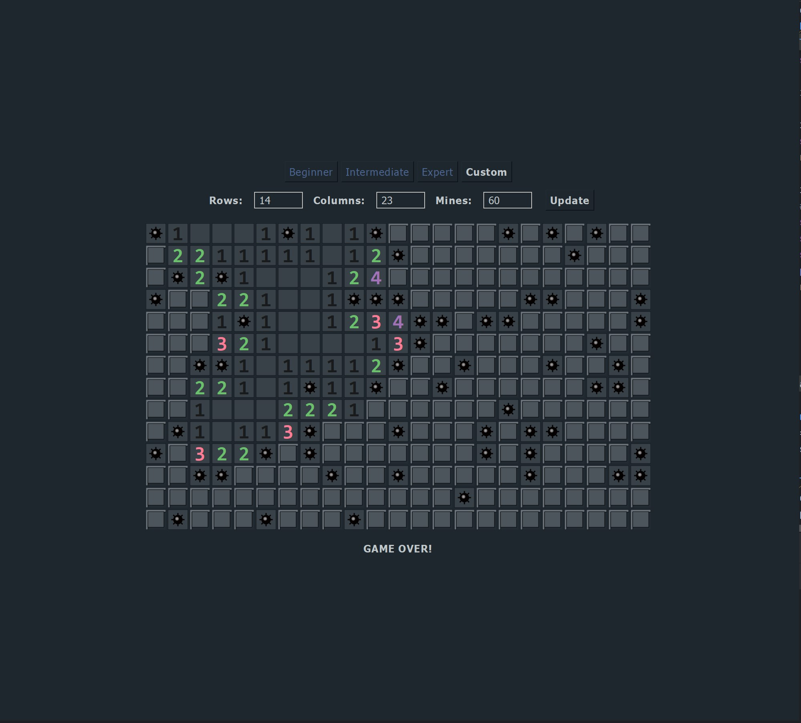
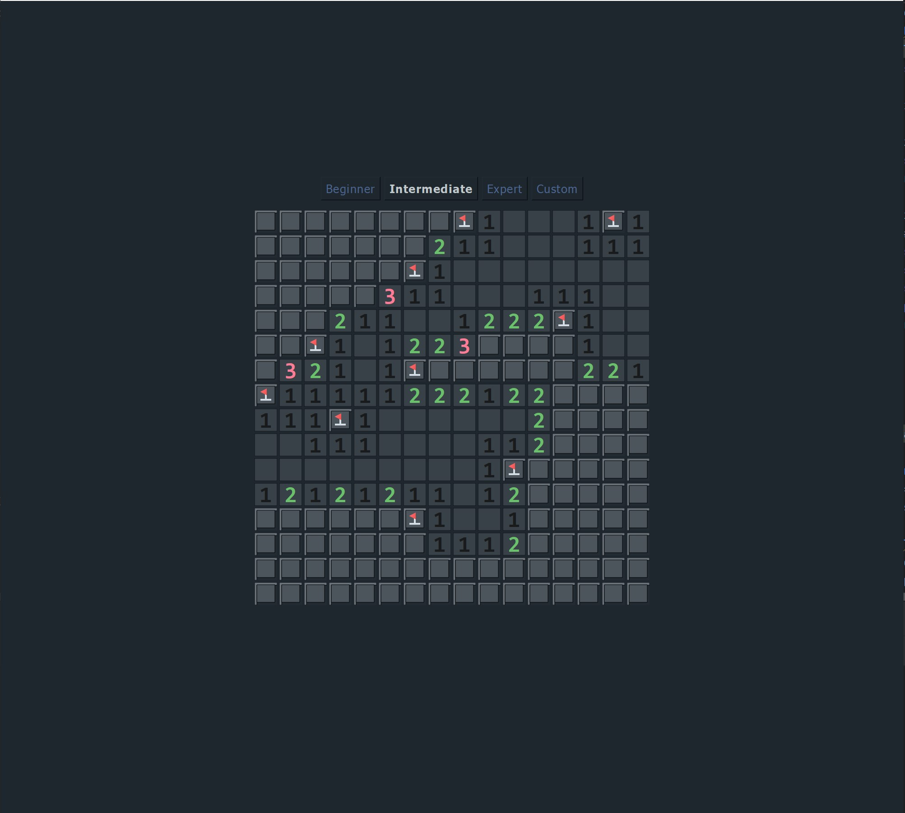
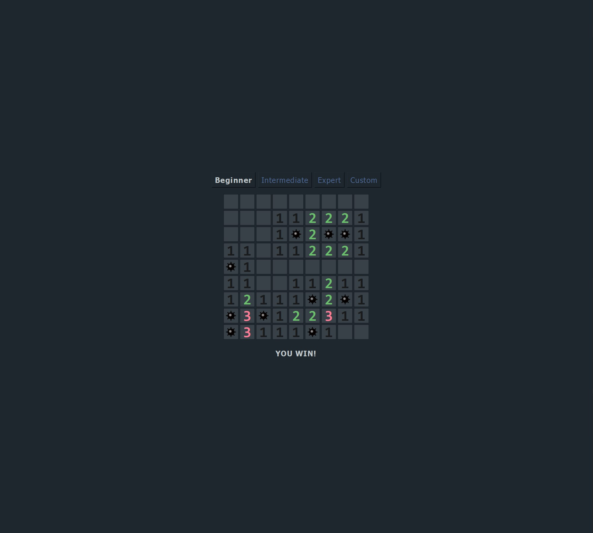

# Minesweeper - PyQt Edition

A custom-built Minesweeper game made using Python and PyQt5. 

This version of Minesweeper includes multiple modes and customizable board sizes. No additional installations are needed to play the game. Just download the executable and start clearing mines!

## Features

- 3 Game different difficulties
- Custom Board Sizes (Choose your own width, height, and number of mines)
- Right-Click Flagging (Place flags with right-click)
- Dynamic Clearing (Clicking empty tiles reveals all adjacent empty tiles automatically)
- Visual Enhancements (Custom Tiles, Flag, and Mine symbols)

## Screenshots

<p float="left">
  
  
  
</p>

## Project Structure

```
Minesweeper/
├── Minesweeper.exe
├── Minesweeper.py
├── Tile.py
├── Board.py
├── imgs/
│   ├── minesweeper-img1.jpg
│   ├── minesweeper-img2.jpg
│   └── minesweeper-img3.jpg
├── .gitignore
└── README.md
```

## Notes

- The `.exe` file includes everything needed to play, so you don’t need Python or any external dependencies.
- Screenshots showcasing gameplay can be found in the `imgs/` folder.
- For developers: you can run the game from the source using Python 3 and PyQt5.
